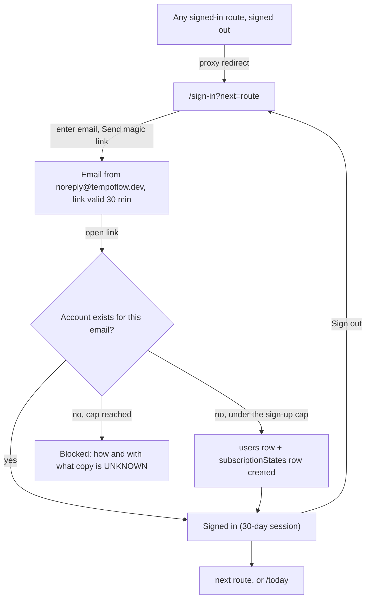
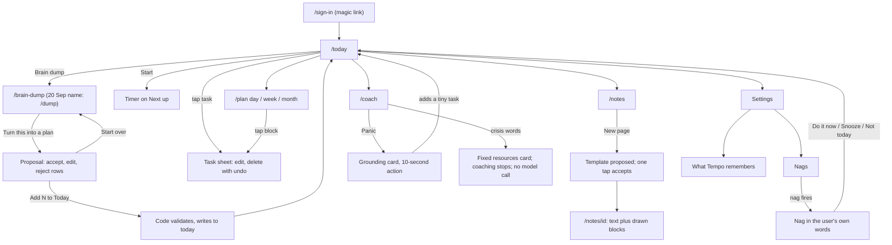

# Tempo Flow: App Flow

> **Last updated 2026-10-03** (IDT) · Written by Grok Bot from the sources below · Decisions are Amit's.
> **Sources:** factory-v2 product docs v2 (20 Sep 2026): `03-APP-FLOW.md` · Basic Memory notes `Weekend factory plan 2026-10-02`, `Weekend goals 2026-10-02`, `Next week — factory decisions and research 2026-10-03` · plan-v3 `WEEKEND-PLAN.md` (legal pages, approval flow) · the 3 Oct component map (code read at `58e36a6`, updated to `5b9675e`) and live walk of `preview.tempoflow.dev` (3 Oct, 13:30–13:43 IDT, signed in by magic link as a test account) · umbrella [#546](https://github.com/Division6066/tempo-rhythm/issues/546) · repo `apps/web/app/**`, `apps/web/proxy.ts`, `apps/web/lib/tempo-nav.ts`.
> **Markers:** UNKNOWN = not known or not decided. (EXTRAPOLATED) = Grok Bot's own fill, not a decision. Newer Amit decisions win over older sources; conflicts are listed in §9.
> **Companion docs:** [PRD](./PRD.md) · [TRD](./TRD.md) · [UI brief](./UI-BRIEF.md) · [Backend schema](./BACKEND-SCHEMA.md) · [Roadmap](./ROADMAP.md)

Two layers are described here: **what the app does today** (§1–§3, from code and the live walk) and **the target flows** (§4–§7, from the 20 Sep design plus 1–3 Oct decisions).

## 1. Routes today

Public (no sign-in): `/`, `/sign-in`, `/sign-up`, `/terms`, `/privacy`, `/contact`, `/success`, `/api/health`. Any other route redirects to `/sign-in?next=…` when signed out (`apps/web/proxy.ts`).
Signed in: 45 page files, grouped as in the sidebar (`apps/web/lib/tempo-nav.ts`). States: **wired** = reads and writes Convex · **partly** = some controls wired · **placeholder** = generic scaffold, no data.

| Group | Route | State (code `5b9675e` + live 3 Oct) | Ticket(s) |
|---|---|---|---|
| Flow | `/today` | partly · loads; quick-add, tick, local brain-dump sort, agenda, energy pick work; AI "Turn this into a plan" fails (provider) | #449, #536–#538, #412, #479 |
| Flow | `/dashboard` | redirect to `/today` | — |
| Flow | `/daily-note` | placeholder | #450, #446 |
| Flow | `/brain-dump` | placeholder | #545, #535 |
| Flow | `/coach` | wired · a reply comes back | #413, #412 |
| Flow | `/plan` | placeholder · "Continue" / "Review" do nothing | #451, #542 |
| Library | `/tasks`, `/tasks/priority`, `/tasks/energy`, `/tasks/checklists` | wired · create, complete, filters persist; no delete; repeat never spawns | #452, #539 |
| Library | `/notes` | wired · create persists | #453 |
| Library | `/notes/[id]` | wired but **crashes on a bad id** | #526 (PR #547 open) |
| Library | `/journal` | placeholder | #454, #446 |
| Library | `/calendar` | wired but **add event never appears** (live); date only, no time | #527, #411, #543 |
| Library | `/habits` | wired · create, check persist; 24-hour window bug | #455, #540 |
| Library | `/habits/[id]` | placeholder · not linked from `/habits` | #455, #541 |
| Library | `/routines`, `/routines/[id]` | placeholder | #456, #447 |
| Library | `/goals`, `/goals/[id]`, `/goals/progress` | placeholder | #457, #458 |
| Library | `/projects`, `/projects/[id]`, `/projects/[id]/kanban` | partly / wired / wired · "Home Reset" project is hard-coded; kanban moves persist | #459 |
| You | `/insights` | wired but **skeleton never resolves** (live) | #528, #460 |
| You | `/history` | wired · chat history empty state works | #461 (scope conflict) |
| You | `/activity` | placeholder | #462 |
| You | `/tracking` | partly · streak tile real; **focus blocks lost on reload** | #463, #534, #544 |
| You | `/templates`, `/templates/editor/[id]`, `/templates/sketch`, `/templates/builder`, `/templates/run/[id]` | placeholder | #464, #466, #448 |
| You | `/search`, `/command`, `/empty-states` | placeholder (⌘K palette navigates only) | #468, #476, #469 |
| Settings | `/settings/profile`, `/settings/preferences`, `/settings/integrations` | placeholder (theme and dyslexia font are device-local) | #470, #471, #472 |
| Settings | `/billing`, `/billing/trial-end` | placeholder | #473 |
| Settings | `/notifications`, `/ask-founder` | placeholder | #474, #475 |
| Settings | `/settings/passkeys` | "Passkeys, coming soon" | #478 |
| Onboarding | `/onboarding` | placeholder | #477 |

Planned public routes (T-LEGAL, plan-v3): `/cookies`, and Hebrew `/he/terms`, `/he/privacy`, `/he/cookies` (`dir="rtl"`, `lang="he"`), linked in the footer and on sign-up.

## 2. Sign-in flow (web, decided: magic link only)

- No password field anywhere on web.
- Next week the cap becomes an approval flow: the person asks to join, Amit gets an email with Approve / Reject, the person sees "You're on the list. We'll email you when you're in." (wording EXTRAPOLATED in plan-v3). Anyone approved before stays approved.
- Turnstile on sign-up: next week.
- **Phone app:** sign-in method UNKNOWN (OTP or magic link, [#425](https://github.com/Division6066/tempo-rhythm/issues/425)). Today `apps/mobile` still shows password sign-in.
- A magic link asked for from a per-PR preview URL most likely lands on `preview.tempoflow.dev`, because `SITE_URL` on `ceaseless-dog-617` points there (EXTRAPOLATED). E2E tests sign in with a stored session file instead (`TEMPO_E2E_STORAGE_STATE`).

## 3. Today's daily loop (what works now)

1. Sign in → `/today` ("Hi, User" until #479).
2. Quick-add a task for today, tick it. Only 3 open tasks show; the rest link to `/tasks`.
3. Today's calendar events and the habit strip show (habits can't be checked from the strip yet).
4. Brain dump: "Sort locally" + "Add selected to today" works; the AI plan path needs the provider fix.
5. `/tasks` for the full list; `/habits` to check a habit; `/notes` for notes; `/coach` to chat.

Gaps for a Sunday planner (umbrella [#546](https://github.com/Division6066/tempo-rhythm/issues/546)): no day plan or time blocks, yesterday's open tasks vanish, habit "today" is a rolling 24 h window, no task delete, no event time or end.

## 4. Target: the main click-path (FD-01)

The first-release gate: sign in → empty Today → brain dump → proposal → **Add N to Today** → reload, same order → tick one.
In the 20 Sep design, accepted rows become `task` blocks appended to today's daily page.

The 20 Sep route names `/dump`, `/dump/proposal`, `/study/*`, `/settings/nags`, `/settings/memory` don't exist in the repo. Mapping `/dump` → `/brain-dump` is (EXTRAPOLATED). Homes for nags, memory and study: UNKNOWN (20 Sep proposed the paths above as EXTRAPOLATED routes).

## 5. Target: Sunday planner flow (#546, EXTRAPOLATED design, not built)

1. Morning on `/today`: "Plan for today" panel: intention, top 3 tasks, energy pick, then **This is my day** (commits the day plan).
2. Time blocks on a timeline for the local day (`/plan` Day view); tick a block done or let it go ("skipped" is neutral).
3. "Still open from earlier days" strip: move tasks to today with one tap.
4. Habit strip: check and undo by **local calendar day**; `/habits/[id]` shows a 6-week grid.
5. `/tracking`: logged focus blocks are saved and survive reload.
6. `/brain-dump`: capture, sort into a task or note, or let go.
7. `/calendar`: events get a start and end time, edit and delete.

Order and tickets: [Roadmap](./ROADMAP.md) §3. Schema: [Backend schema](./BACKEND-SCHEMA.md) §3.

## 6. Target: nags, templates, memory, coach

**Nag flow** (rule from 20 Sep; steps EXTRAPOLATED):
1. On a task or habit: **Nag me about this.**
2. The user types phrases in their own words (acronyms and in-jokes are the point).
3. The app may offer phrases derived from the user's own words; each shows where it came from; accept or reject each.
4. A nag with no accepted phrase can't be switched on.
5. At the due time a Convex cron picks the nag and one phrase and delivers it. Delivery at V1 beyond in-app: UNKNOWN.
6. Answers: **Do it now** (opens Today with that task as Next up), **Snooze**, **Not today**. "Not today" is never failure; partial credit applies.
7. The answer is logged as dosing data, never shown as a streak.

**Template flow:** New page → the app proposes one template (daily / weekly / monthly pages get theirs on first open) → code copies the body, resolves tokens like `{{next_monday}}`, gives every block a fresh id → **Make this page a template** works on any page. Whether the app picks silently or always shows its pick: UNKNOWN.

**Memory flow:** "What Tempo remembers": view, forget one, forget all, export as markdown. The coach calls `context` before replying and `remember` after.

**Coach:** opens at the current dial (0–10). Bad-day words lower the dial by two and say so. Panic → grounding card + one 10-second action.

## 7. Screen states and copy

| Screen | Empty | Error | What the AI does |
|---|---|---|---|
| Today | "Nothing on today yet. A brain dump takes a minute." All done: "That's the list. Rest counts." | "Couldn't load today. Your list is safe." + Retry (EXTRAPOLATED copy) | No call on load. Pacing 2→4 tasks in Now; late tasks slide to Later without comment. |
| Brain dump | "Everything. Any order. Fragments are fine." | Text kept; Try again | Nothing until submit. |
| Proposal | All rejected: button off | Falls back to the rule-based local split (EXTRAPOLATED) | Turns lines into tasks with duration and reason. Nothing written until the tap. |
| Plan | Fixed events only | Retry | No model; elastic items reflow around fixed ones. |
| Note page | Blank editor | A broken block draws as "This part has a problem." + Undo. No JSON. (EXTRAPOLATED) | On request, proposes edits by block id; accept or reject each. |
| Coach | Opens at the dial | "The coach is offline. Your list still works." (EXTRAPOLATED) | Replies at the dial's intensity. Crisis words: fixed card, no model call. |
| Billing | Price shows "—" until loaded | inline | None. Billing is never hidden. |

Repo copy guide: [`brand-voice.md`](https://github.com/Division6066/tempo-rhythm/blob/integration/docs/design/claude-export/design-system/brand-voice.md) ("Warm, direct, specific, never shaming").

## 8. Rules on every screen

Never shame · accept / reject is law · undo for 5 minutes inside the app, confirm anything external · study never mixes into `/today` · a screen never holds a use-case · no JSON, ever · every visible control does its job ("works after sign-in") · signed-in screenshots never go on GitHub.

## 9. Conflicts and open questions

| Older source | Newer decision or fact (wins) |
|---|---|
| 20 Sep: `/sign-in` = "email magic link or password" | 1–2 Oct: magic link only on web. |
| 20 Sep: ten V0 screens with routes `/dump`, `/plan?view=`, `/study`, `/settings` … | Repo has 45 page routes with other names (e.g. `/brain-dump`, `/calendar`, `/settings/profile`). The 30 Sep wiki called this "PATH_DRIFT". Which naming wins: UNKNOWN. |
| 20 Sep: Today pulls from one daily page of blocks | #546 (3 Oct) builds the Sunday planner on typed tables (`dayPlans`, `timeBlocks`, …). Not an Amit ruling either way: UNKNOWN. |

Open (UNKNOWN): nag delivery channel at V1 · whether a brain dump is kept as a page · homes for nags, memory, templates and study · timeline start (06:00 or wake time) · week start Sunday or Monday (code: Monday; #546 question 3) · what the capped-out sign-up screen says · `/history` meaning (chat history in code vs completed items in #461).
