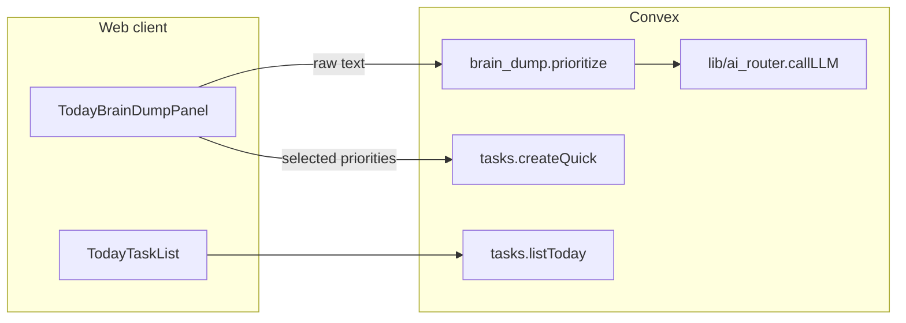

# Today + Brain Dump — Developer Guide

How the `/today` activation loop works in the current codebase. For product validation evidence, see [`docs/phase4-brain-dump-validation.md`](./phase4-brain-dump-validation.md). For ship-state labels, see [`docs/SHIP_STATE.md`](./SHIP_STATE.md).

---

## Purpose

The Today view is the Phase 1 activation surface: sign in → paste a messy brain dump → get a prioritized plan → add selected items to today's task list. The flow is designed to be overwhelm-first (anti-shame copy, explicit confirm before writes).

---

## Route and layout

| Piece | Path |
|---|---|
| Page entry | `apps/web/app/(tempo)/today/page.tsx` |
| Screen component | `apps/web/components/today/TodayScreen.tsx` |
| Brain dump panel | `apps/web/components/today/TodayBrainDumpPanel.tsx` |
| Quick add | `apps/web/components/today/TodayQuickAdd.tsx` |
| Task list | `apps/web/components/today/TodayTaskList.tsx` |

Post-auth landing: `/dashboard` redirects to `/today` (`apps/web/app/(app)/dashboard/page.tsx`).

---

## Data flow

### 1. Plan (read-only preview)

`TodayBrainDumpPanel` calls `api.brain_dump.prioritize` (Convex **action**).

- **Auth:** requires `ctx.auth.getUserIdentity()`; throws a user-honest error if unsigned.
- **Input limit:** 12,000 characters (`MAX_RAW_CHARS` in `convex/brain_dump.ts`).
- **Persistence:** the raw dump is **not** stored in Convex (RAM-only processing for this action).
- **Output:** `{ summary, priorities[] }` where each priority has `title`, `reason`, and `urgency` (`now` | `soon` | `later`).

The action uses `callLLM` with tier `balanced` (`mistral-medium-latest` by default) and `responseFormat: "json_object"`. Parsing and validation live in `parsePlanFromModelContent()` (also unit-tested).

### 2. Local fallback

If the server action fails (missing `MISTRAL_API_KEY`, rate limit, upstream error), the panel falls back to `prioritizeBrainDump()` in `apps/web/lib/brainDumpPrioritizer.ts`. The UI labels the source:

- `Source: server planner` — AI path succeeded
- `Source: local sort` — keyword/heuristic fallback

### 3. Apply to Today (user-confirmed write)

User selects priorities, then clicks **Add to Today**. Each selection calls `api.tasks.createQuick` with:

- `title` from the priority
- `dueAt` set to the end of the user's local calendar day (passed from `useLocalDayBounds()`)

This is a direct mutation, not an AI proposal card — the user explicitly selects items before apply.

### 4. Today's task list

`TodayScreen` queries `api.tasks.listToday` with `{ dueFrom, dueTo }` from `useLocalDayBounds()`. Bounds refresh at local midnight, on tab focus, and on visibility change so overnight tabs do not tag tasks with yesterday's date.

---

## Local day bounds

`apps/web/lib/useLocalDayBounds.ts` + `apps/web/lib/todayBounds.ts` compute `{ startMs, endMs }` for the user's local calendar day. Tests: `apps/web/lib/todayBounds.test.ts`.

---

## Environment

| Variable | Scope | Purpose |
|---|---|---|
| `MISTRAL_API_KEY` | Convex dashboard | Powers `brain_dump.prioritize` via `ai_router` |
| `NEXT_PUBLIC_CONVEX_URL` | `apps/web/.env.local` | Web client → Convex deployment |

Without `MISTRAL_API_KEY`, the loop still works via the local fallback sorter.

---

## Tests

| Area | File |
|---|---|
| Plan JSON parsing + control-char stripping | `convex/brain_dump.test.ts` |
| Local prioritizer heuristics | `apps/web/lib/brainDumpPrioritizer.test.ts` |
| Local midnight bounds | `apps/web/lib/todayBounds.test.ts` |

Run: `bun test` from repo root.

---

## Constraints (do not break)

1. **RAM-only dump** — `prioritize` must not persist raw brain-dump text to Convex.
2. **Auth on public functions** — both `prioritize` and `createQuick` verify identity / user record.
3. **Anti-shame errors** — action errors use plain, non-blaming language (see `convex/brain_dump.ts` catch blocks).
4. **Accept-reject for future AI writes** — if brain-dump processing later auto-creates tasks, those writes must flow through the proposal / confirm pattern (HARD_RULES §1). Current apply path is explicit user selection.

---

## Related routes (not the same implementation)

| Route | Status |
|---|---|
| `/brain-dump` | `ScaffoldScreen` shell only (`apps/web/app/(tempo)/brain-dump/page.tsx`) |
| `/today` | Full implementation (this doc) |

The standalone `/brain-dump` route is a design placeholder; the working loop lives on `/today` via `TodayBrainDumpPanel`.
