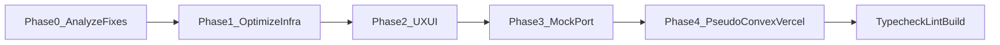

# Mega frontend port plan (web + mobile, mock phase)

**Status:** living plan — extend as infra changes.  
**Goal:** Full Claude-export parity for 42 web routes + 12 mobile routes using `@tempo/ui`, `@tempo/mock-data`, and **machine-readable pseudo-code** that names **Convex + Vercel + schema** concerns for Long Run 2.

**Constraints (unchanged):** Do not edit attached planning artifacts if they are read-only elsewhere; this file is the repo-local execution plan. No Convex imports in UI during mock phase unless a ticket explicitly allows. Do not merge your own PRs unless Amit says so.

---

## Phase 0 — Analyze the fixes you just landed (before any screen work)

**Purpose:** Your monorepo / GitHub / Vercel fixes are now the baseline. The port must sit *on top of* that baseline, not fight it.

1. **Git / branch hygiene**
   - Confirm local `master` matches `origin/master` after your merges.
   - Skim recent commits touching CI, Turbo, Vercel, workspaces, and lockfile (`bun.lock`).

2. **Monorepo + Turbo**
   - Read [turbo.json](../../turbo.json): task graph (`build` → `^build`, `typecheck`/`lint` inputs).
   - Confirm `apps/web` build outputs match Turbo `outputs` (`.next/**`).
   - Note any package that still lacks `typecheck`/`lint` scripts (Turbo will skip or fail — align before mega-diff).

3. **GitHub Actions**
   - Read [.github/workflows/ci.yml](../../.github/workflows/ci.yml): Bun 1.3.9, Node 24, frozen lockfile, Turbo cache keys, required job names for branch protection.
   - **Optimization check:** if CI is slow, prefer fixing cache restore keys / `dependsOn` in Turbo over disabling checks. Document any intentional CI change in the eventual PR.

4. **Vercel**
   - Read [apps/web/vercel.json](../../apps/web/vercel.json): monorepo `installCommand` from repo root, `ignoreCommand` via `turbo-ignore` for `tempo-rhythm-web`, framework `nextjs`.
   - **Optimization check:** ensure Preview builds only when `apps/web` or its deps change (already hinted by `turbo-ignore`); if previews still churn, tighten ignore paths or document Vercel project “Root Directory” vs repo root.

5. **Convex (read-only for this phase)**
   - Skim [convex/schema.ts](../../convex/schema.ts) (or split schema files) so pseudo-code **table names, indexes, and function slugs** match reality or are explicitly flagged as “to add in Long Run 2”.
   - Do **not** wire `convex/react` in mock-phase routes; only **name** the future API in comments.

**Deliverable of Phase 0:** Short “infra delta” note (bullet list) appended to the eventual PR body: what you fixed, what the port assumes, and any follow-up for Twin/Amit on Vercel dashboard-only items.

---

## Phase 1 — Optimization layer (on top of your fixes)

**Purpose:** Small, high-leverage improvements that make the mega-port easier to review and deploy — without re-opening closed infra debates.

1. **Workspace + lockfile:** `@tempo/mock-data` as `workspace:*` in web + mobile; `bun install` once; `bun run typecheck && lint && build` green before UI bulk.
2. **Turbo:** If a new package (`mock-data`) is added, ensure it has `typecheck` / `lint` scripts so Turbo graph stays coherent.
3. **Vercel:** Confirm preview URL smoke path (open `/today`, `/sign-in`) after build; note any env vars required for *non-mock* later (`NEXT_PUBLIC_CONVEX_URL`, auth) in pseudo-code only.
4. **Bundle / RSC:** Prefer Server Components where the export is static; use `"use client"` only where there is interactivity — call that out in `@vercel` notes below.

---

## Phase 2 — UX / UI layer (on top of optimization)

**Purpose:** Match the design export; polish only where it does not conflict with repo tokens, a11y, or brand voice.

1. **Source of truth:** [docs/design/claude-export/design-system/](claude-export/design-system/) + [screen-inventory.md](screen-inventory.md).
2. **Primitives:** `@tempo/ui` — SoftCard, Button, Field, Pill, Ring, TaskRow, HabitRing, CoachBubble, icons; avoid inline styles unless necessary (one-line comment).
3. **Brand:** [docs/brain/brand/voice.md](../../docs/brain/brand/voice.md) for any net-new strings; keep export copy verbatim where the cluster requires it.
4. **States:** Each route: empty / loading / error (local `mode` state) as required by the ticket cluster.
5. **Accessibility:** Buttons for actions, labels on inputs, heading order — match existing web/mobile patterns.

---

## Phase 3 — Full screen port (mock data only)

Same vertical breakdown as before: Flow → Library → Goals/Projects → You/Settings → Templates → marketing → bare auth/onboarding → mobile A → mobile B.

**Imports allowed in route files:** `react`, `next/*` (web), `expo-router` / RN (mobile), `@tempo/ui`, `@tempo/mock-data`, `@/components/tempo/*` only where the ticket allows, `@/lib/*` only if ticket allows.

**Forbidden in mock phase:** `convex/*`, direct OpenRouter SDKs, ad-hoc `fetch` to production APIs (except documented static assets).

---

## Phase 4 — Pseudo-code: Convex + Vercel + schema (Long Run 2 contract)

**Purpose:** Comments must read like a **mini spec** for the wiring agent: what Convex does, where it runs on Vercel, and which schema tables/indexes are touched.

Base rules remain in [pseudo-code-conventions.md](pseudo-code-conventions.md) (`@action`, `@mutation`, `@query`, `@navigate`, `@optimistic`, `@auth`, `@errors`, `@source`, etc.).

**Add the following tags in JSX comment blocks** (immediately above the interactive element or in the route header for global concerns). Keep values grep-friendly and stable.

| Tag | When to use | Example |
|-----|----------------|--------|
| `@convex` | Any read/write | `@convex: { table: "tasks", index: "by_user_and_due", fn: "api.tasks.listToday", args: "{ userId, dayStart }" }` |
| `@schema` | Non-obvious fields / validators | `@schema: { fields: ["title", "dueAt", "status"], validator: "tasks.createArgs" }` |
| `@vercel` | Rendering / runtime / env | `@vercel: { surface: "client", reason: "useState + optimistic UI", env: ["NEXT_PUBLIC_CONVEX_URL"] }` |
| `@vercel:edge` | Only if proposing Middleware / Edge | `@vercel:edge: { file: "middleware.ts", behavior: "auth redirect for /(tempo)/*" }` |
| `@deploy` | Preview vs prod nuance | `@deploy: { preview: "Convex dev deployment", prod: "Convex prod + Vercel prod" }` |

**Route-level header extension** (add under existing `@screen` block where relevant):

```tsx
/**
 * @convex-deployment: client uses ConvexReactClient; URL from NEXT_PUBLIC_CONVEX_URL
 * @schema-read: tasks, calendarEvents, coachThreads
 * @schema-write: tasks.capture, tasks.complete
 * @vercel: { build: "apps/web via turbo", ignore: "turbo-ignore tempo-rhythm-web" }
 */
```

**Per-button example:**

```tsx
{/*
  @action: completeTask
  @mutation: tasks.complete({ taskId })
  @convex: { table: "tasks", index: "by_id", fn: "api.tasks.complete", args: "{ taskId }" }
  @schema: { patch: { status: "done", completedAt: "number" } }
  @vercel: { surface: "client", reason: "optimistic checkbox" }
  @optimistic: mark row done, fade 240ms
  @auth: required
  @errors: toast calm copy per brand
  @source: screens-1.jsx:L200-L220
*/}
```

**Rules:**

- Use **real** table/index names from [convex/schema.ts](../../convex/schema.ts) when they exist; if the schema does not yet have the table, use `@convex: { table: "(planned) coachMessages", fn: "(planned) api.coach.send" }` — never invent silently.
- `@vercel` is about **where code runs** and **env**, not marketing copy.
- Do not duplicate forbidden-tech stack (no Clerk, no Prisma, etc.) — CI `scan:forbidden-tech` must stay green.

---

## Verification gates (unchanged)

Before declaring the branch ready to push (when Amit says go):

- `bun run typecheck`
- `bun run lint`
- `bun run build`
- Spot-check changed routes locally; list URLs in PR.
- Optional: run repo scan scripts if present (`scan:forbidden-tech`, etc.).

---

## Deliverables when Amit approves push

- Branch: e.g. `feat/T-F000-full-port` (or stacked PRs if strategy changes).
- PR: ticket IDs, acceptance criteria, screenshots, **infra delta** from Phase 0, **pseudo-code tag** summary (`rg "@convex:" apps`, `rg "@vercel:" apps`).
- Do not merge until Amit says so.

---

## Execution order summary



Phase 4 can be applied **during** Phase 3 (annotate as you port), but Phase 0 must complete first so annotations align with the **current** schema and deploy layout.
